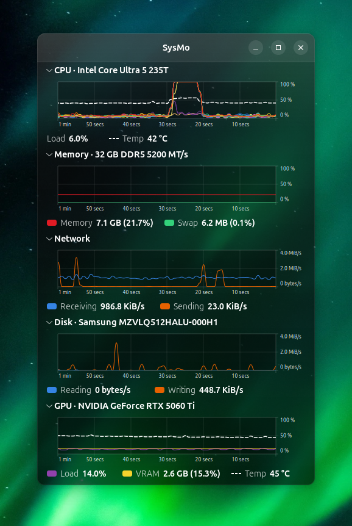
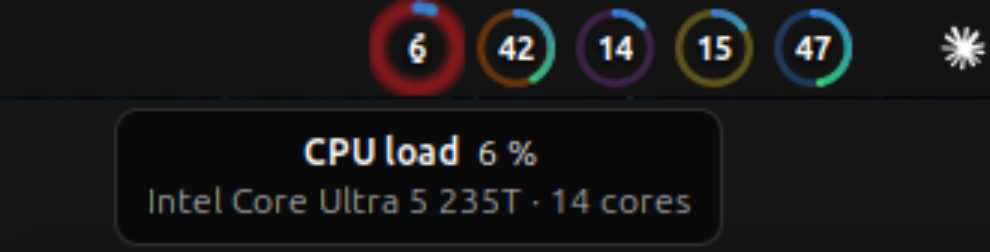

# SysMo

A compact system monitor for GNOME that looks like the stock **System
Monitor → Resources** tab, drawn on dark glass, and adds what that tab is
missing: **CPU temperature, GPU load, VRAM and GPU temperature** — plus five
live ring gauges in the top bar.



## Why this exists

GNOME System Monitor has the right look and the right update rate, but it
cannot show a CPU temperature and knows nothing about your GPU. Mission
Center knows all of that, but its interface is a Windows Task Manager
lookalike. SysMo keeps Mission Center's sensor engine, throws its interface
away, and rebuilds the one page worth having.

## What you get

* **CPU** — one curve per core in System Monitor's colours, plus the package
  temperature as a dashed white curve on the same graph (1 % = 1 °C)
* **Memory and swap**
* **Network** — receive and send, auto-scaling axis
* **Disk** — read and write, summed across drives
* **GPU** — utilisation, VRAM use and temperature for every discrete GPU. An
  integrated Intel GPU is hidden automatically when a discrete card exists.
* Section titles name your actual hardware: CPU model, memory size, type and
  speed, disk model, GPU model
* Graphs sample once a second and scroll at ten frames a second, exactly like
  GNOME System Monitor. Every section collapses and remembers its state.
* Closing the window keeps SysMo running for the top-bar gauges;
  <kbd>Ctrl</kbd>+<kbd>Q</kbd> quits properly.

### Top bar gauges


Five ring gauges: CPU load, CPU temperature, GPU load, VRAM and GPU
temperature. Each ring fills clockwise from 12 o'clock (a full turn is 100)
and its colour follows the reading along the arc — cool blue at rest, green
from 45, yellow from 65, red from 80. Each gauge also keeps an identity
colour in its faint track ring.

Behind the number a glossy disc fades in from 55, blends through amber and
orange to red by 80 and deepens towards 100, with no hard steps. Temperatures
use the same numbers in °C. With more than one GPU, the three GPU gauges show
the average across the GPUs.


Hovering a gauge enlarges it and names the reading; clicking one opens or
raises the SysMo window.



## How SysMo was made

SysMo is a **fork of [Mission Center][mc]** (upstream `main`, commit
`fd060f17`, September 2026). Mission Center's engine was kept and its entire
user interface was deleted and rewritten — about 20,000 of 23,000 front-end
lines are gone.

The code SysMo inherits comes from **four upstream repositories**:

| Repository | What it provides | Licence | How it is included |
|---|---|---|---|
| [magpie][magpie] | The sensor engine: every reading SysMo shows. A separate process, spoken to over an nng socket with Protocol Buffers. | GPL-3.0-or-later | git submodule, built unmodified as `sysmo-magpie` |
| [app-rummage][rummage] | Application detection; a build dependency of magpie. | MIT | nested submodule inside magpie |
| [NVTOP][nvtop] | The GPU backend — utilisation, VRAM, temperature, power. | GPL-3.0 | downloaded, checksummed and patched by magpie's build script |
| [GNOME System Monitor][gsm] | The graph rendering. `src/graph.rs` is a Rust and cairo port of its `load-graph.cpp` and `gsm-graph.c`, reproducing the grid, time axis, smooth scrolling and axis rounding. | GPL-2.0-or-later | ported source, not copied |

[CREDITS.md](CREDITS.md) has the exact commits, what was kept, what was
removed, and the licence reasoning.

## Requirements

* **Ubuntu 24.04 or newer**, or any distribution with GTK 4.14 and
  libadwaita 1.5. Mission Center's own interface needs GTK 4.22; SysMo
  deliberately does not, so it builds on current Ubuntu.
* **GNOME 45 or newer** for the top-bar gauges (tested on GNOME 46, X11 and
  Wayland). The window itself works on any desktop.
* **Rust 1.90 or newer.** Ubuntu's `rustc` package is 1.75 and too old, so
  install Rust with rustup as shown below.
* An internet connection for the first build (it fetches NVTOP and the Rust
  crates).

## Installation

These steps work on a freshly installed Ubuntu. Copy them one block at a
time.

### 1. Install the build dependencies

```bash
sudo apt update
sudo apt install -y build-essential cmake curl desktop-file-utils git \
    libadwaita-1-dev libdrm-dev libgbm-dev libudev-dev \
    meson ninja-build patch pkg-config python3
```

### 2. Install Rust

```bash
curl --proto '=https' --tlsv1.2 -sSf https://sh.rustup.rs | sh -s -- -y --profile minimal
source "$HOME/.cargo/env"
```

### 3. Get the source

The engine is a submodule, so clone recursively. A plain `git clone` will not
build.

```bash
git clone --recurse-submodules https://github.com/lumigrade/SysMo.git
cd SysMo
```

Already cloned without submodules? Run `git submodule update --init --recursive`.

### 4. Build and install

```bash
meson setup build --prefix="$HOME/.local" -Dbuildtype=release
ninja -C build install
```

Everything is installed for your user only; no `sudo`, nothing outside your
home directory:

| Path | What |
|---|---|
| `~/.local/bin/sysmo` | the application |
| `~/.local/bin/sysmo-magpie` | the sensor engine |
| `~/.local/share/sysmo/hw.db` | hardware name database |
| `~/.local/share/applications/` | app launcher entry |
| `~/.local/share/glib-2.0/schemas/` | settings schema |
| `~/.local/share/gnome-shell/extensions/sysmo-gauges@sysmo.org/` | the top-bar gauges |
| `~/.config/autostart/` | starts SysMo at login |

**The first build takes several minutes** — it compiles the engine and NVTOP
from source. Later builds take seconds.

### 5. Turn on the top-bar gauges

GNOME Shell only looks for new extensions when it starts, so restart it
once and then enable the extension:

* **On X11:** press <kbd>Alt</kbd>+<kbd>F2</kbd>, type `r`, press Enter.
* **On Wayland:** log out and log back in.

```bash
gnome-extensions enable sysmo-gauges@sysmo.org
```

Check it worked:

```bash
gnome-extensions info sysmo-gauges@sysmo.org
```

It should say `State: ACTIVE`. The gauges appear as soon as SysMo is running.

### 6. Start it

```bash
sysmo
```

or launch **SysMo** from the app grid. From the next login it starts on its
own. To stop that, either pass `-Dautostart=false` when configuring the build
or delete `~/.config/autostart/org.sysmo.SysMo.desktop`.

If the `sysmo` command is not found, `~/.local/bin` is not on your `PATH`;
log out and back in, since Ubuntu adds it at login when the directory exists.

## Using it

| Action | Result |
|---|---|
| Click the pin button | keep the window on top of others (needs the top-bar extension); remembered across restarts |
| Click a section title | collapse or expand it; remembered across restarts |
| Close the window | window hides, gauges keep updating |
| <kbd>Ctrl</kbd>+<kbd>Q</kbd> | quit for real, engine included |
| Click a top-bar gauge | open or raise the window |
| Hover a top-bar gauge | reading, device name and detail |

## Uninstalling

```bash
ninja -C build uninstall
gnome-extensions disable sysmo-gauges@sysmo.org
```

## Troubleshooting

**The gauges are not in the top bar.** Restart GNOME Shell (step 5) and
confirm `gnome-extensions info sysmo-gauges@sysmo.org` says `ACTIVE`. Errors
show up in `journalctl --user -u org.gnome.Shell@x11.service -f`.

**Gauges show `–` or say "SysMo is not running".** Start SysMo; the gauges
read from it over D-Bus and hold no sensors of their own.

**CPU temperature shows `n/a`.** The engine reads `coretemp`, `k10temp` or
`zenpower` under `/sys/class/hwmon`. Check with
`for h in /sys/class/hwmon/hwmon*; do cat $h/name; done`.

**GPU section missing or empty.** NVIDIA cards need the proprietary driver
(NVML). Confirm with `nvidia-smi`.

**Build fails while fetching NVTOP.** That step needs network access; rerun
`ninja -C build install` once you are online.

**Memory says just the size, without type or speed.** Memory module details
come from DMI data exposed by udev. Some firmware does not publish it.

## For developers

```bash
cargo build --release --manifest-path subprojects/magpie/Cargo.toml   # engine
cargo build --release                                                # front end
SYSMO_DATA_DIR=build/src target/release/sysmo                        # run it
```

| Path | What |
|---|---|
| [`src/main.rs`](src/main.rs) | entry point, signal handling |
| [`src/window.rs`](src/window.rs) | the window, the 100 ms clock, saved state |
| [`src/sections.rs`](src/sections.rs) | the five sections and their legends |
| [`src/graph.rs`](src/graph.rs) | the GNOME System Monitor graph port |
| [`src/engine/`](src/engine) | starts the engine, samples it over nng |
| [`src/dbus.rs`](src/dbus.rs) | publishes the gauge figures |
| [`extension/`](extension) | the GNOME Shell extension |

Environment variables: `SYSMO_ENGINE` (engine binary), `SYSMO_DATA_DIR`
(directory holding `hw.db`), `SYSMO_ENGINE_SOCKET` (attach to a running
engine), `G_MESSAGES_DEBUG=SysMo` for logging.

The gauges read `org.sysmo.SysMo` at `/org/sysmo/SysMo/Gauges`, interface
`org.sysmo.SysMo.Gauges`, properties `Values` (`a{sd}`), `Names` and
`Details` (`a{ss}`), with `PropertiesChanged` on every sample:

```bash
gdbus call --session --dest org.sysmo.SysMo \
  --object-path /org/sysmo/SysMo/Gauges \
  --method org.freedesktop.DBus.Properties.GetAll org.sysmo.SysMo.Gauges
```

After editing the extension, reinstall and restart GNOME Shell; stylesheet
changes also need the extension disabled and enabled again.

## Licence

GPL-3.0-or-later — see [COPYING](COPYING). SysMo inherits code from Mission
Center, magpie, app-rummage, NVTOP and GNOME System Monitor; their authors
and licences are credited in [CREDITS.md](CREDITS.md).

[mc]: https://gitlab.com/mission-center-devs/mission-center
[magpie]: https://gitlab.com/mission-center-devs/gng
[rummage]: https://gitlab.com/mission-center-devs/app-detection
[nvtop]: https://github.com/Syllo/nvtop
[gsm]: https://gitlab.gnome.org/GNOME/gnome-system-monitor
